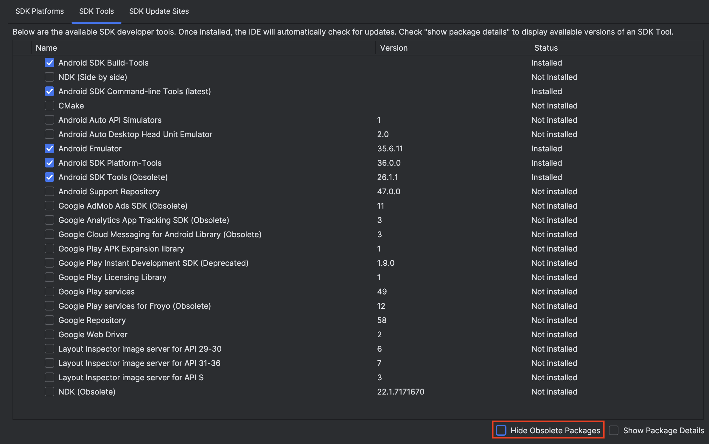
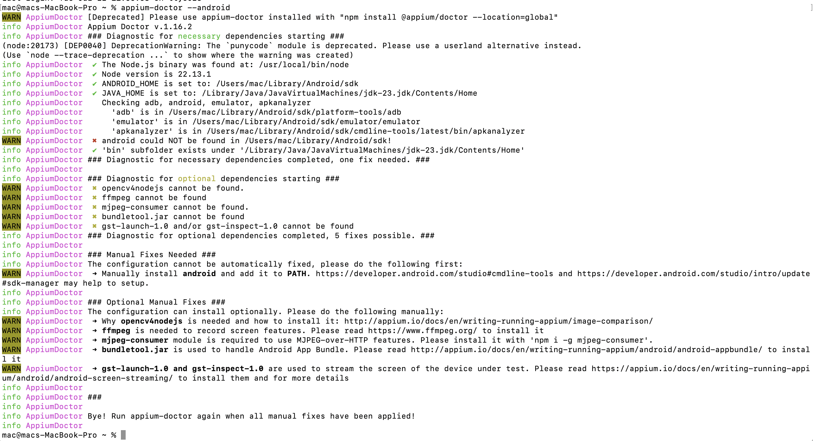

##  Android Setup
Follow the steps below to set up Appium for Android testing on your local machine.

---

####  Prerequisites

- Node.js (v16 or later recommended)
- Java Development Kit (JDK 11 or later)
- Android Studio (for Android SDK & Emulator)
- Appium server (via npm)
- Android device or emulator
- `adb` (Android Debug Bridge)

---

####  Step-by-Step Installation

1. **Install Node.js**
```
brew install node   # macOS
sudo apt install nodejs npm  # Ubuntu
```

2. Install Appium
```commandline
npm install -g appium
```
3. Install Appium Doctor (to verify setup)
```commandline
npm install -g appium-doctor
```
4. Install Java JDK
- [Download JDK](https://www.oracle.com/java/technologies/downloads/?er=221886)
- Set environment variables:
```commandline
export JAVA_HOME=$(/usr/libexec/java_home)
export PATH=$JAVA_HOME/bin:$PATH
```
5. Install Appium Android Driver (UiAutomator2)

```commandline
appium driver install uiautomator2
```

6. Install Android Studio
- Download and install from: https://developer.android.com/studio
- During setup, ensure the following components are installed:
   - Android SDK
   - Android SDK Platform Tools
   - Android Emulator
   - A system image for a virtual device



Set Android environment variables
```commandline
export ANDROID_HOME=$HOME/Library/Android/sdk
export PATH=$ANDROID_HOME/emulator:$ANDROID_HOME/tools:$ANDROID_HOME/tools/bin:$ANDROID_HOME/platform-tools:$PATH
```

7. Make Sure All the Requirements are In Place
Run the appium doctor command to make sure all the requirements are installed
```commandline
appium-doctor --android
```
The output should appear like the following



8. Run Appium Server
Run the appium server to start the testing
```commandline
appium
```

9. Start Android Emulator
Let's list available Android device, type the following commands
```commandline
emulator -list-avds
```
From the shown device names, copy name of device of your choice and update `android_caps.json` under
`mobile_app/configs` folder of this project, i.e. if the device name is `Samsung S23`, it should look like
```json
{
  "platformName": "Android",
  "platformVersion": "16",
  "deviceName": "Samsung S23",
  "automationName": "UiAutomator2",
  "app": "apps/GETTR.apk",
  "noReset": false,
  "appium:autoAcceptAlerts": true,
  "appium:autoGrantPermissions": true
}
```
If your android device runs a different version, then update the `platformVersion` accordingly.
Make sure `GETTR.apk` is placed under `mobile_app/apps`

Run the selected emulator
```commandline
emulator -avd Samsung S23
```
10. Run the Test cases
```commandline
pytest --platform android tests/mobile_app/tests
```

##  Running Tests on a Real Android Device

To run tests on a real Android device instead of an emulator, follow the steps below.

>  Note: Steps might slightly vary depending on your Android device model or OS version.

---

###  Enable Developer Options & USB Debugging

1. On your Android device, go to **Settings > About phone**
2. Tap **Build number** 7 times to enable Developer Mode
3. Navigate to **Settings > System > Developer options**
4. Enable **USB debugging**

---

###  Connect the Device

1. Connect your Android device to your computer using a USB cable
2. Run the following command in terminal to verify connection:

```bash
adb devices
```
3. If prompted on your phone, authorize USB debugging

 Your device should now appear in the list of attached devices.

#### Update your desired_capabilities in the configuration file to reflect your real device's settings and run tests.
