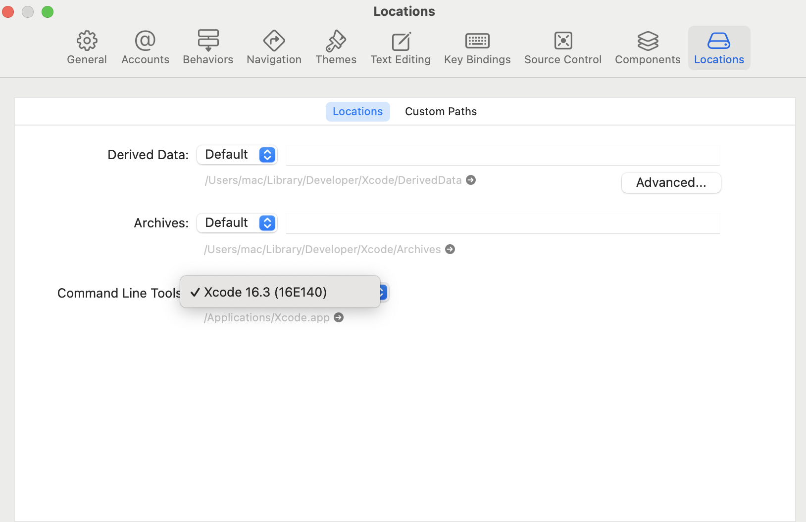
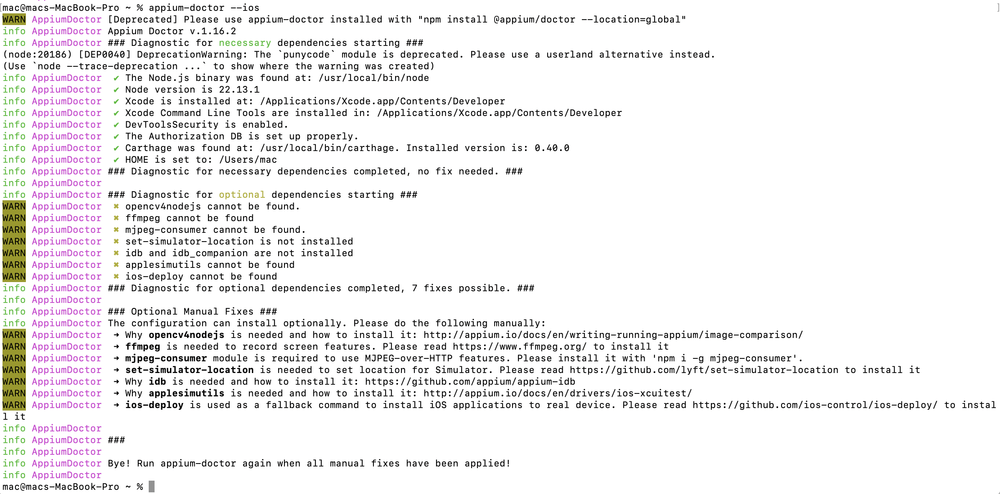

##  iOS Setup
Follow the steps below to set up Appium for iOS testing on your local machine.

---

####  Prerequisites

- macOS with **latest updates**
- **Node.js** (v16 or later)
- **Java Development Kit (JDK)** — version 11 or higher
- **Xcode** (latest version)
- **Xcode Command Line Tools**
- **Appium** (installed via `npm`)
- **Appium Doctor**
- **iOS device** or **Simulator**

---

####  Step-by-Step Installation

1. **Install Node.js**
```
brew install node   # macOS
brew install ffmpeg   # Needed for iOS screenshots and video recording
```

2. Install Appium
```commandline
npm install -g appium
```
3. Install Appium Doctor (to verify setup)
```commandline
npm install -g appium-doctor
```
4. Install Java JDK
- [Download JDK](https://www.oracle.com/java/technologies/downloads/?er=221886)
- Set environment variables:
```commandline
export JAVA_HOME=$(/usr/libexec/java_home)
export PATH=$JAVA_HOME/bin:$PATH
```

5. Install Appium iOS Driver (xcuitest)

```commandline
appium driver install xcuitest
```

6. Install Xcode (from App Store)
After the installation, agree to the license
```commandline
sudo xcodebuild -license
```
Install command line tools:
```commandline
xcode-select --install
```

7. Install Xcode dependencies for WebDriverAgent

- WebDriverAgent is used to communicate with iOS devices
- Open Xcode > Preferences > Locations and select a Command Line Tools version



7. Make Sure All the Requirements are In Place
Run the appium doctor command to make sure all the requirements are installed
```commandline
appium-doctor --ios
```
The output should appear like the following



8. Run Appium Server
Run the appium server to start the testing
```commandline
appium
```

9. Start iOS device
Let's list available iOS device, type the following commands
```commandline
xcrun simctl list devices
```
From the shown device names, copy name of device of your choice and update `ios_caps.json` under
`mobile_app/configs` folder of this project, i.e. if the device name is `iPhone 16`, it should look like
```json
{
  "platformName": "iOS",
  "platformVersion": "18.4",
  "deviceName": "iPhone 16",
  "automationName": "XCUITest",
  "app": "apps/GETTR.apps",
  "noReset": false,
  "appium:autoAcceptAlerts": true,
  "appium:autoGrantPermissions": true
}
```
If your android device runs a different version, then update the `platformVersion` accordingly.
Make sure `GETTR.app` is placed under `mobile_app/apps`
`NOTE:` for reald device, use `.ipa` file instead of `.app` file

Run the selected simulator using UUID or name
```commandline
xcrun simctl boot "iPhone 16" && open -a Simulator
```
or
```commandline
xcrun simctl boot 29A7027B-4B20-4108-920D-117738B36331
```
10. Run the Test cases
```commandline
pytest --platform ios tests/mobile_app/tests
```

##  Running Tests on a Real iOS Device

To execute Appium tests on a real iOS device (iPhone or iPad), follow the setup steps below.

>  **Note:** You must use a macOS system with Xcode installed. Device must be physically connected via USB.

---

###  Prerequisites for iOS Real Device Testing

1.  **macOS machine** with [Xcode](https://developer.apple.com/xcode/) installed
2.  **Real iOS device** (connected via USB)
3.  **Appium server** installed globally
4.  **Python 3.9+** with project dependencies installed
5.  **WebDriverAgent** configured and signed with valid Apple Developer credentials
6.  **iOS-deploy** tool to install `.ipa` files

---

###  Step-by-Step Setup

#### 1.  Enable Developer Mode on the Device

- Connect your iOS device via USB
- On the device, go to **Settings > Privacy & Security > Developer Mode**
- Enable **Developer Mode** and restart the device when prompted

#### 2.  Install `ios-deploy` (if not already installed)

```bash
brew install ios-deploy
```
This utility allows installing .ipa files directly onto a real device.

#### 3.  Code Sign WebDriverAgent
- WebDriverAgent (used by Appium to communicate with iOS devices) must be built and signed:

- Open the Appium WebDriverAgent project (/usr/local/lib/node_modules/appium/node_modules/appium-webdriveragent) in Xcode

- Set the correct Team under Signing & Capabilities

- Build both WebDriverAgentLib and WebDriverAgentRunner for your connected device

#### 4.  Install the App on Device
Use ios-deploy or Xcode to install the signed .ipa:

```bash
ios-deploy --justlaunch --debug --bundle /path/to/your_app.ipa
```
Ensure the .ipa is properly signed with a provisioning profile that includes your device UDID.

#### Update your desired_capabilities in the configuration file to reflect your real device's settings and run tests.
